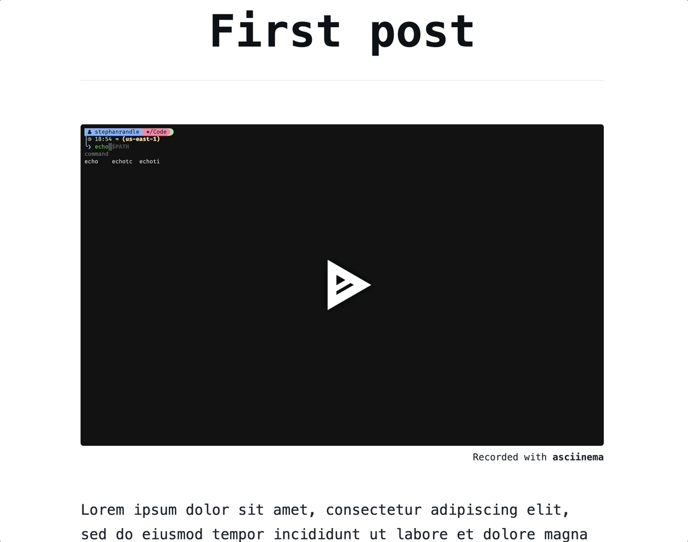

# remark-asciinema

A [remark](https://github.com/remarkjs/remark) plugin that transforms asciinema links into either an embedded [asciinema](https://docs.asciinema.org/manual/player/) player or screenshot that links to the recording.

[](https://badge.fury.io/js/remark-asciinema)

## Features

- 🪄 Automatically converts asciinema links into:
  - `<script>` embeds for live asciinema players
  - `` tags for static cast thumbnails that link to the recording

## Example



Before:

```markdown
Check out this demo: https://asciinema.org/a/12345
```

After (HTML output):

```html
Check out this demo:
<script
  id="asciicast-12345"
  src="https://asciinema.org/a/12345.js"
  async
></script>
```

## Installation

```bash
pnpm install remark-asciinema
```

## Usage

```js
import { remark } from "remark";
import asciinema from "remark-asciinema";

const file = await remark()
  .use(asciinema)
  .process("Check out: https://asciinema.org/a/abc123");

console.log(String(file));
```
